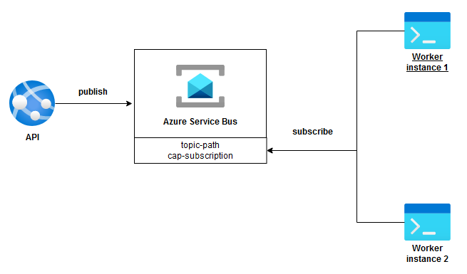

# CAP + Azure Service Bus

## Introduction

This repository serves as a straightforward example of utilizing [CAP](https://github.com/dotnetcore/CAP)
with [Azure Service Bus](https://learn.microsoft.com/en-us/azure/service-bus-messaging/service-bus-messaging-overview)
and SQL Server for storage. Given the limited content available on this specific combination, I undertook the initiative
to establish this repository.

Within this project, you can explore how a web application can dispatch messages to a queue, and a background worker can
consume them. Additionally, it provides insight into the behavior of the queue when multiple workers are concurrently
processing the messages.



## Running the project

This project can be run on a Docker container or locally. As this project uses Azure Service Bus, you will need to
create a namespace and a queue. Creating them is not covered in this repository, but you can
follow [this guide](https://docs.microsoft.com/en-us/azure/service-bus-messaging/service-bus-quickstart-portal) to
create them.

Once the queue is created, you will need to update the `appsettings.Development.json` and `appsettings.Docker.json`
files from both projects `NetCapDemo.Web` and `NetCapDemo.Worker` with the connection string and the queue name.

```json
{
  "AzureServiceBus": {
    "Connection": "<service-bus-connectionstring>",
    "Topic": "<service-bus-topic>"
  }
}
```

### Docker

To run the project on Docker, you will need to have Docker installed on your machine. Once you have Docker installed,
you can run the following command to build the images and run the containers.

```bash
### Make sure you are in the root directory of the project
docker-compose -f docker-compose.yml -f docker-compose.test.yml up -d
```

The file `docker-compose.yml` setup SQL Server database and `docker-compose.test.yml` sets up both web and worker applications

Once the containers are up and running, you can access the web application at http://localhost:8000/swagger/index.html.
From there, you can execute the endpoint to send a message to the queue. Then, keep a console log open, either through
Docker Desktop or the one used to build the images. You should observe logs showing the messages being processed by the
worker.

Please note that there might be a database connection issue the first time the container is created. This issue arises
due to a race condition between the initial database creation and access. However, it should not affect the app's
functionality apart from generating error logs. If any problems do arise, you can simply stop and start the container
again to resolve them.

### Local

To run the project locally, you will need to have SQL Server running. You can achieve this by executing the following command to create a database container.

```bash
### Make sure you are in the root directory of the project
docker-compose up -d
```

## CAP Version Selection
It's important to mention that this project is using CAP packages version "7.2.1." Despite the availability of version "7.2.2" as of December 14, 2023, I opted to stick with version "7.2.1." This decision was made due to an issue with version "7.2.2," which seems to register handlers twice, causing compatibility problems with .NET worker.
